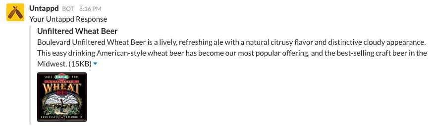

# Slack Untappd

A [Slack](https://slack.com/) [(Slash Command Server)](https://api.slack.com/slash-commands) for searching the [Untappd Beer Search API](https://untappd.com/api/docs#userbeers) for information about a given beer.

## Basic Usage

1. Register for [Untappd API Credentials](https://untappd.com/api/register?register=new)
2. Get the server running somewhere on a public host
3. Configure a Slack Slash Command. [See Slack Docs](https://api.slack.com/slash-commands)

The following environment variables must be set:

* `SLACK_TOKEN` - The token assigned to the slash command integration (can contain multiple comma seperated tokens)
* `UNTAPPD_CLIENT_ID` - Your Untappd API client ID
* `UNTAPPD_CLIENT_SECRET` - Your Untappd API client secret token

### Request

The server expects a POST request from Slack with the following form values:

* token
* user_name
* text

These values should be present in the default slack POST in addition to other non-used values.

### Response

The server will do a lookup on the Untappd API for the given `text` in the Slack POST. If no result is found an `ephemeral` (only displayed to requesting user) message will be returned stating that no results were found. If results are found an `in_channel` (displayed to anyone in the channel) message will be returned.

### Example

**Warning:** This example is for illustrative purposes only. Refer to the actual documentation above for the specific request/response formats.

The following request:

```
[server_url]/?token=123Token456&user_name=kpurdon&text=Boulevard+Wheat
```

will generate the following JSON response:

```
{
  response_type: "in_channel",
  text: "Your Untappd Response",
  attachments: [
    {
      title: "<https://untappd.com/b/unfiltered-wheat-beer/10501|Boulevard Brewing Co. Unfiltered Wheat Beer>",
      text: "Pale Wheat Ale - American | 14 IBU | 4% ABV Boulevard Unfiltered Wheat Beer is a lively, refreshing ale with a natural citrusy flavor and distinctive cloudy appearance. This easy drinking American-style wheat beer has become our most popular offering, and the best-selling craft beer in the Midwest.",
      image_url: "https://untappd.akamaized.net/site/beer_logos/beer-_10501_sm_223bb99cc9949e694ada7d88309095.jpeg"
    }
  ]
}
```

which if configured correctly in slack will produce the following post:


