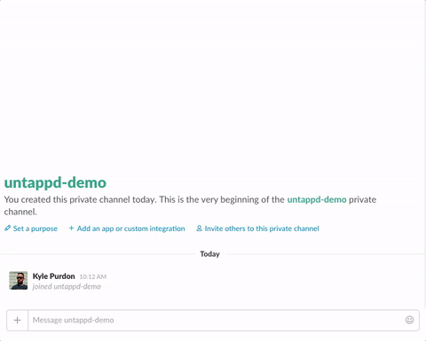
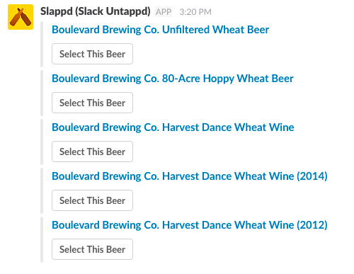
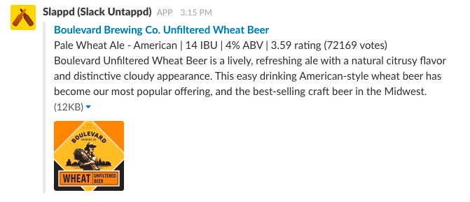

**If you are interested in donating public hosting for this application it would be very easy to let anyone on slack use this with the click of a button. Right now I am running it on a private host for only a couple slack teams.**

# Slappd (Slack Untappd)

A [Slack](https://slack.com/) [(Application)](https://api.slack.com/apps) for searching the [Untappd Beer Search API](https://untappd.com/api/docs#userbeers) for information about a given beer.

## Basic Usage

1. Register for [Untappd API Credentials](https://untappd.com/api/register?register=new)
2. Get the server running somewhere on a public host
3. Configure a Slack Application. [See Slack Docs](https://api.slack.com/slash-commands).

TODO (03-13-2017): Add more details about Slack Application configuration.

The following environment variables must be set:

* `SLACK_TOKEN` - The token assigned to the slash command integration (can contain multiple comma seperated tokens)
* `UNTAPPD_CLIENT_ID` - Your Untappd API client ID
* `UNTAPPD_CLIENT_SECRET` - Your Untappd API client secret token

### Request

The server expects a POST request from Slack with the following form values:

* token
* user_name
* text

These values should be present in the default slack POST in addition to other non-used values.

### Response

The server will do a lookup on the Untappd API for the given `text` in the Slack POST. If no result is found an `ephemeral` (only displayed to requesting user) message will be returned stating that no results were found. If results are found an `in_channel` (displayed to anyone in the channel) message will be returned.

### Interactions

A user will type `/untappd Boulevard Wheat` which will produce:

a user then has the option to select the desired beer which will produce:

